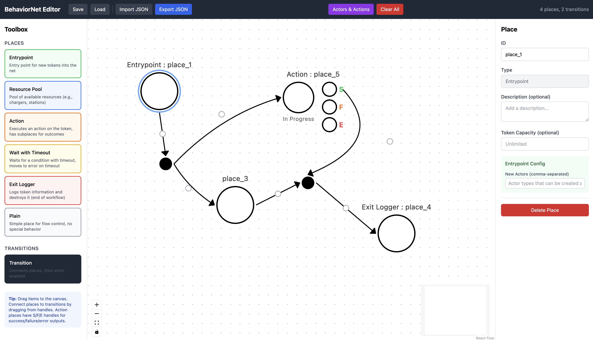

# Petri Net Editor

A visual web-based editor for creating and editing Petri nets. Built with React, TypeScript, and React Flow.



## Features

- **Drag-and-drop interface** - Add places and transitions by dragging from the toolbox
- **Visual connections** - Draw arcs by dragging between nodes
- **Auto-create transitions** - Drag between two places to automatically create a connecting transition
- **Editable IDs** - Click on any place or transition ID to rename it
- **Draggable arc curves** - Adjust arc paths by dragging the control point
- **Import/Export** - Save and load nets as JSON files
- **Browser storage** - Quick save/load to browser local storage
- **Configurable** - Customize place types, tool name, and features via config files

## Quick Start

```bash
# Install dependencies
npm install

# Start development server
npm run dev

# Build for production
npm run build
```

Open http://localhost:5173 in your browser.

## Configuration

The editor is highly configurable through two JSON files in the `public/` folder:

### Tool Configuration (`tool_config_*.json`)

Controls which features are enabled:

```json
{
  "toolName": "Petri Net Editor",
  "enabledPlaceTypes": ["plain"],
  "enableActorsFeature": false
}
```

| Field | Description |
|-------|-------------|
| `toolName` | Name displayed in the toolbar |
| `enabledPlaceTypes` | Array of place types available in the toolbox |
| `enableActorsFeature` | Show/hide the Actors & Actions registry |

### Place Types (`supported_places.json`)

Defines all available place types and their parameters:

```json
{
  "placeTypes": {
    "plain": {
      "label": "Plain",
      "description": "Simple place for flow control",
      "color": "gray",
      "hideTypeLabel": true,
      "params": {}
    },
    "action": {
      "label": "Action",
      "description": "Executes an action on the token",
      "color": "orange",
      "hasSubplaces": true,
      "subplaces": ["success", "failure", "error"],
      "params": {
        "actionId": { "type": "actionRef", "required": true },
        "retries": { "type": "integer", "min": 0, "default": 0 }
      }
    }
  }
}
```

### Switching Configurations

Use environment variables to select different configurations:

```bash
# Default (BehaviorNet editor with all features)
npm run dev

# Minimal Petri net editor
npm run dev:pn

# Or specify directly
VITE_TOOL_CONFIG=tool_config_PN_editor.json npm run dev
```

## Usage

### Creating a Net

1. **Add places** - Drag place types from the left toolbox onto the canvas
2. **Add transitions** - Drag "Transition" from the toolbox onto the canvas
3. **Connect nodes** - Drag from a place to a transition (or vice versa) to create an arc
4. **Quick connect** - Drag from one place to another to auto-create a transition between them

### Editing

- **Select** - Click on any node to view/edit its properties in the right panel
- **Move** - Drag nodes to reposition them
- **Rename** - Click the ID field in the inspector to edit
- **Curve arcs** - Drag the small control point on any arc to adjust its curve
- **Delete** - Use the delete button in the inspector panel

### Saving/Loading

- **Save** - Saves to browser local storage (persists across sessions)
- **Load** - Loads from browser local storage
- **Export JSON** - Downloads the net as a JSON file
- **Import JSON** - Loads a net from a JSON file

## Export Format

The exported JSON includes:

```json
{
  "places": [
    { "id": "place_1", "type": "plain" }
  ],
  "transitions": [
    { "from": ["place_1"], "to": ["place_2"], "priority": 1 }
  ],
  "_gui_metadata": {
    "places": { "place_1": { "position": { "x": 100, "y": 100 } } },
    "transitions": { "transition_1": { "position": { "x": 200, "y": 100 } } },
    "edgeOffsets": { "place_1->transition_1": { "x": 0, "y": 20 } }
  }
}
```

## Tech Stack

- [React 18](https://react.dev/) - UI framework
- [TypeScript](https://www.typescriptlang.org/) - Type safety
- [React Flow](https://reactflow.dev/) - Node-based UI
- [Zustand](https://zustand-demo.pmnd.rs/) - State management
- [Tailwind CSS](https://tailwindcss.com/) - Styling
- [Vite](https://vitejs.dev/) - Build tool

## Project Structure

```
├── public/
│   ├── supported_places.json      # Place type definitions
│   ├── tool_config_PN_editor.json # Minimal PN config
│   └── tool_config_BN_editor.json # Full BehaviorNet config
├── src/
│   ├── components/
│   │   ├── Canvas/                # React Flow canvas & nodes
│   │   ├── Inspector/             # Property editor panels
│   │   ├── Sidebar/               # Toolbox & registry
│   │   └── Toolbar/               # Top toolbar
│   ├── store/
│   │   ├── netStore.ts            # Zustand state management
│   │   ├── placeConfig.ts         # Config loading
│   │   └── types.ts               # TypeScript types
│   ├── utils/
│   │   ├── configExport.ts        # JSON export
│   │   └── configImport.ts        # JSON import
│   └── styles/
│       └── index.css              # Global styles
└── package.json
```

## License

MIT
